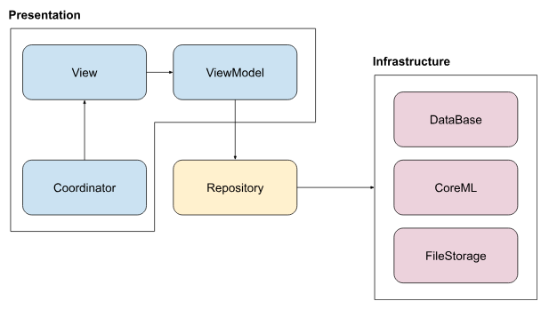

# SnapTag

SnapTagは写真をタグ付けして管理が行えるサンプルアプリケーションです。  
サーバーなどに依存せずスタンドアロンで動作します。  
写真登録時にCore MLを用いてタグの推薦を行います。  

## Environment
- Xcode 16.1
- Swift 6.0
- iOS 17.0+

## Architecture
MVVM + SwiftUI / UIKitハイブリッド構成で構築しています

